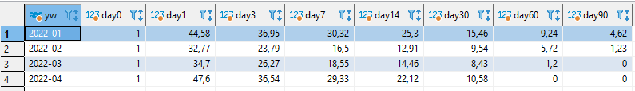

# Постановка задачи

У нашего партнера - платформы с задачами и тестами IT Resume стоит задача - они хотят сменить модель монетизации на платформе. 

В данный момент монетизация осуществляется за счет внутренней валюты - CodeCoins. Люди получают монеты за активность на платформе (когда решили задачу или прошли тест, например) и тратят их на закрытые задачи и другие материалы. Если людям монет не хватает - они могут их купить за деньги. Такая система хорошо подходит для геймификации (людям нравится, что они то получают монеты, то списывают, то опять получают), но у нее есть ряд существенных недостатков:

- Ее сложно продавать - практически никакой рекламной стимуляции валюта не подвергается
- На нее сложно делать акции
- Большинство людей покупает маленькие пакеты монет (да и сами пакеты недорогие)
- Человек может единоразово купить монет и ему хватит надолго

Сейчас ребята из IT Resume хотят попробовать другую модель - классическую подписку. Грубо говоря, будет несколько тарифов и пользователь сможет выбрать - либо ему пользоваться ограниченным функционалом, либо купить месячную подписку, либо годовую, но с большой скидкой. 

Основная сложность заключается в том, что есть ряд вопросов, на которые не хочется отвечать «от балды» - хочется в своих ответах опираться на данные (тот самый `data-driven` подход). Собственно, вот основные вопросы:

- Какие временные промежутки закладывать в подписку (неделя, месяц, год)?
- Какую сделать стоимость подписки? 
- Что включить в состав подписки? Например, можно сделать платными все решения, а можно ограничить число попыток - поле для фантазий тут очень широкое. 

Сразу стоит обозначить несколько принципиальных моментов относительно смены модели монетизации, которые вам нужно будет учесть в дальнейшей работе:

- Весь базовый функционал платформы должен быть бесплатным. То есть большинство задач должно быть открыто даже в бесплатной версии.
- Некоторые части базового функционала можно урезать и делать платными. Что именно - пока не понятно.
- В платную подписку должны входить дополнительные фичи. Например, топовые задачи от компаний; дополнительные разделы сайта (например, кейсы или вопросы).
- Подписка должна быть представлена в нескольких вариантах. Как минимум, одна краткосрочная подписка (кто хочет здесь и сейчас порешать задачки), одна - долгосрочная (кто в целом постоянно занимается саморазвитием).

Естественно, пока что это просто наши мысли - мы не подкрепляли свои гипотезы расчетами. Это вам и предстоит сделать!

# Задание

Чтобы помочь IT Resume в решении поставленных вопросов, вам нужно написать следующие SQL-запросы и написать свои выводы по каждому из них:

1. Расчет `rolling retention` с разбивкой по когортам. В качестве когорт берем месяц регистрации на платформе. В качестве `n-дней` - 0, 1, 3, 7, 14, 30, 60 и 90 дней. 

Напомним, что такое `rolling retention`:

> Rolling retention - метрика, которая показывает, какая доля людей от общего числа зарегистрировавшихся проявляла активность на платформе в день N или любой день после. 

Учитывая, что мы смотрим в разрезе когорт, можно уточнить формулировку так:

> Rolling retention - метрика, которая показывает, какая доля людей от общего числа зарегистрировавшихся в месяц Х проявляла активность на платформе в день N или любой день после. 

День `N` - это как раз те самые `n-дни`, которые описаны в задании. 

В результате должна получится примерно вот такая таблица (не смотрите на числа, только на формат): 

**Примечание:** Обратите внимание, что в примере `retention` рассчитан в `%` (т.е. не `0.1`, а `10`) и округлен до 2 знака после запятой. Сделайте также

Эта метрика поможет понять, насколько активно пользователи пользуются продуктом и сколько людей возвращаются на платформу спустя некоторое время. Это позволит сделать выводы относительно оптимального срока тарифов.

2. Расчет метрик относительно баланса пользователя:

* сколько в среднем коинов списывает 1 человек
* сколько в среднем коинов начисляется 1 человеку
* какой средний баланс среди всех пользователей 
* какой медианный баланс среди всех пользователей

Постарайтесь вывести всю эту информацию с помощью 1 SQL-запроса. 

Эти показатели помогут понять - как сформировать стоимость подписки. Зная курс 1 код коина к рублю, ребята смогут посчитать ориентировочную сумму тарифа, исходя из средних показателей.

**Совет:** Вы работаете с PostgreSQL, поэтому для расчета медианы можно воспользоваться конструкцией `mode within group`.

3. Расчет метрик активности пользователей на платформе:

* Сколько в среднем пользователь решает задач
* Сколько в среднем пользователь проходит тестов
* Сколько в среднем пользователь делает попыток для решения 1 задачи
* Сколько в среднем пользователь делает попыток для прохождения 1 теста

Все эти метрики считаем только для тех пользователей, которые проходили тесты или решали задачи. Понятно, что если человек задачи не решал - то его не нужно считать в усреднении. Однако, дополнительно важно оценить:

* Какая доля от общего числа пользователей решала хотя бы одну задачу или начинала проходить хотя бы один тест

Плюс еще информация по покупкам материалов на платформе за кодкоины - эти 6 чисел нужно вывести 1 запросом, чтобы было наглядно:

* Сколько человек открывало задачи за кодкоины
* Сколько человек открывало тесты за кодкоины
* Сколько человек открывало подсказки за кодкоины
* Сколько человек открывало решения за кодкоины
* Сколько подсказок/тестов/задач/решений было открыто за кодкоины (если задача/... открыта разными людьми, то это считаем разными фактами открытия)
* Сколько человек покупало хотя бы что-то из вышеперечисленного
* Сколько человек всего имеют хотя бы 1 транзакцию, пусть даже только начисление

Все это поможет принять решение - какой функционал лучше включить в состав платной подписки. 

# Дополнительное задание

Помимо тех метрик, которые ребята запросили, вам нужно немного «покопаться» в данных и предложить 3 дополнительные метрики, которые на ваш взгляд будут им полезны в решении этой задачи. 

Распишите, что это за метрики, почему они полезны и приложите SQL-запросы для их расчета.

# Дополнительное задание 2

Помимо этого, есть еще небольшая задачка. CTO (технический директор) IT Resume хочет оценить, в какое время оптимально производить релизы (выкатывать новый функционал на платформу). Для этого ему нужно знать:

- в какие дни чаще/реже всего люди проявляют активность на платформе
- в какое время люди больше/меньше всего решают задачи/тесты на платформе

Для этого вам нужно:

- Написать запрос, в котором вы соберете данные об активностях пользователей
- Выгрузить данные в `csv`
- С помощью Python загрузить полученный файл и построить график распределения посещений по времени суток/дням недели

В результате нужно приложить: 

1. SQL-запрос
2. Python код
3. График
4. Выводы с ответами на вопросы CTO - когда же это лучше делать

# Описание базы данных

Ребята поделились небольшим кусочком своей базы, чтобы вам было удобно проводить аналитику. Естественно, это не все данные и многие из них изменены, но этого вполне хватит, чтобы писать SQL-запросы.

Данные для подключения к базе:

```
Хост: 87.239.110.151
Порт: 5432
База данных: simulative
Юзер: student
Пароль: qweasd963
```

Информация о таблицах:

* `users` - таблица с информацией о пользователях. Поле `date_joined` - дата и время регистрации пользователя. 
* `userentry` - таблица входов каждого пользователя. Фиксируется первый вход пользователя в каждый день.
* `coderun` - в таблицу делается запись, когда пользователь нажимает кнопку `Выполнить` в задаче.
* `codesubmit` - в таблицу делается запись, когда пользователь нажимает кнопку `Проверить` в задаче. Поле `is_false=1` значит, что задача решена неверно.
* `teststart` - в таблицу делается запись, когда пользователь нажимает кнопку `Начать тест` (каждая отдельная попытка - отдельная запись).
* `transaction` - в таблицу делаются записи обо всех транзакциях - как списаниях монет, так и начислениях.
* `transactiontype` - в этой таблице описаны основные типы транзакций. По ним можно понять - в таблице `transaction` произошло списание или начисление. 

Относительно таблицы `transactiontype`:

* Списания - транзакции с `type in (1, 23, 24, 25, 26, 27, 28, 30)`
* Начисления - все остальное

# Рекомендации по выполнению 

Для решения первой задачи вам понадобятся таблицы `userentry` (информация о входах на платформу) и `users` (отсюда берем дату регистрации). 

Для решения второй задачи вам понадобятся таблицы `transaction` (для расчета баланса и списаний/начислений) и `transactiontype` (чтобы понять, какой тип у транзакции - `Списание` или `Начисление`)

Для решения последней задачи вам понадобятся таблицы:

* «сколько решает задач» - `coderun + codesubmit`
* «сколько проходит тестов» - `teststart`
* «сколько открывает/покупает» - `transaction + transactiontype`

Для самостоятельного исследования вы можете использовать любые таблицы на ваш вкус - главное, чтобы предложенная вами метрика была полезна для решения поставленной задачи. 

Для решения задач, поставленных CTO, вам пригодятся таблицы `coderun + codesubmit + teststart`. В Python можете использовать любые библиотеки и фреймворки - например, `pandas` и `matplotlib/seaborn`.

# Как оформить результат

1. Сделайте форк этого репозитория себе в github-аккаунт. Инструкция о том, как делать форк - [тут](https://www.freecodecamp.org/news/how-to-make-your-first-pull-request-on-github-3/). 
2. Создайте в папке, где лежит файл с заданием, файл `solution.md`.
3. Решите все задания, которые предлагают ребята из IT Resume. 
4. Сделайте промежуточный коммит и назовите его `Решил(а) задания от IT Resume`. Инструкция о том, как сделать коммит в [той же статье](https://www.freecodecamp.org/news/how-to-make-your-first-pull-request-on-github-3/).
5. Выполните вторую часть задания с самостоятельным исследованием. 
6. Сделайте второй коммит с названием `Предложил(а) новые метрики`.
7. Выполните третью часть задания от CTO.
8. Сделайте третий коммит с названием `Решил(а) задачи CTO`.
9. Не забудьте ознакомиться с шаблоном оформления файла `solution.md` - он описан ниже. Если внесли какие-то изменения - сделайте коммит с пометкой `Оформление результата`.
10. Когда все будет готово, сделайте пул-реквест в исходный репозиторий. Инструкция о том, как делать пул-реквест - [тут]().

**Примечание:** Пул-реквест назовите по шаблону `{{ваше ФИО}}`

После того, как вы сделаете пул-реквест, преподаватель его проверит и даст свое заключение прям в вашем пул-реквесте. Критерии оценки смотрите ниже. 

# Шаблон оформления

Файл `solution.md` для текущего задания нужно оформить так:

## Задание 1

```sql
select ...
```

Выводы: ...


## Задание 2

```sql
select ...
```

Выводы: ...

## Задание 3

```sql
select ...
```

Выводы: ...

## Дополнительное задание

Мне кажется ... Для этого я предлагаю посчитать ..., потому что:

- причина 1
- причина 2
- причина 3

Код для расчета:

```sql
select ...
```

Выводы:

## Итоговые выводы по смене модели монетизации

Я считаю, что вам нужно сделать так-то ..., потому что ..... А еще, беря во внимание, ...., нужно сделать так-то ...

## Дополнительное задание 2

Для выгрузки данных используем SQL-запрос:

```sql
select ...
```

Для загрузки данных, построения графика, ..., используем такой код:

```python
def foo(a, b):
    # не забудьте писать комментарии в коде, чтобы преподаватель понимал, что вы делаете
    ...
```

Выводы: Рекомендую проводить релизы в такой-то день ..., в такое-то время ..., потому что ....


# Критерии оценки

Максимальное число баллов - 45. 

1. Правильность написания кода и построенных графиков: 0-10
2. Оптимальность написанного кода: 0-5
3. Код стайл: 0-5
4. Качество предложенных метрик и их обоснованность: 0-10
5. Качество выводов (промежуточных и итоговых): 0-10
6. Правильность оформления задания: 0-5

# Заключение

Этот итоговый проект - реальная задача от нашего партнера. Отнеситесь к ней со всей серьезностью - представьте, что вы на стажировке в IT Resume. Не пренебрегайте аккуратностью, мелочами и написанием выводов/комментариев - все это очень важно. 

# Дополнительные материалы

- Небольшой стайл гайд для кода на питон - [ссылка](https://vk.com/itresume?w=wall-197837145_1165)
- Небольшой стайл гайд для кода на SQL - [ссылка](https://vk.com/itresume?w=wall-197837145_1473)